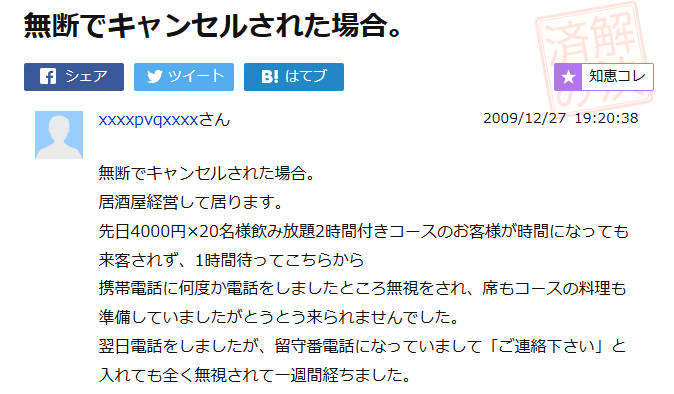
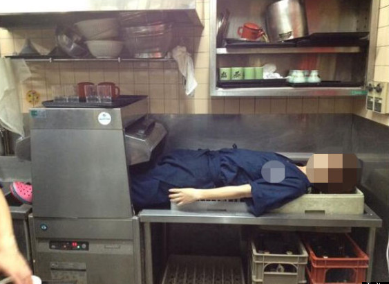

###　飲食店向け総合サポートサービス
  
<!--  

 

-->

 

2017/8/31 春木直也

<!--
まずこのテーマをとりあげようと思ったきっかけから話を始めさせていただきます。
以前、EPARKさんのくら寿司予約システムの案件に携わっていました。
くら寿司さん以外にも、さまざまな飲食店の予約などが簡単に行えます。
とても使いやすく、お客様のことを第一に考えたシステムだなと思いました。
けれども、お店側の立場にたった場合どういうサービスが考えられるだとうというところから、
少し調べてみようとおもったことがきっかけです。
-->

---

### サービス概要
  
主に飲食店をメインターゲットとした、サービスを提供。チェーン店のようなノウハウを持った店舗よりも、
個人経営しているような小さな店をターゲットとし、売り上げ向上につながるサービス及び、
SNSによる風評被害、無断キャンセルによる予期せぬ被害を最小限に抑えるための店舗用の保険サービスなどを含めた総合サポートサービスを提供。
<!--
仮に予約サービスのみであれば多数あり対抗できないかもしれませんが、
店側の立場を優先させた様々なサービスがひとまとめにしたものを提供できれば、まだまだ入り込む余地があると思われます
ちなみに今回は飲食店に特化して話を進めさせていただきますが、接客業務が発生するどんな店舗でも導入可能なシステムだと思います。
-->

---
###　無断キャンセルの被害
 
 
- 4000円×20名のキャンセル(被害額8万円) 

 

<!--
WEBからみつけた記事をはらせていただいています。
団体客の無断キャンセルにより、この方は合計8万円の損害をうけたそうです。
簡単にボタン一つで予約できて楽な反面、連絡すらせず無断でキャンセルしてしまう方法をとってしまう人が存在するようですが、
このようなことが起これば、小さな飲食店では死活問題です。用意した食材も無駄になってしまいますが、その時間の人件費、
もしかしたら現れるかもしれないので座席を確保するために他のお客を入れられなどで、実際はそれ以上の損失となってしまいます。
裁判する時間、手間などで泣き寝入りするケースが多い状況です
-->

---
###　SNSによる風評被害
 
- 蕎麦屋の店員がTwitter上に悪ふざけ画像をアップ 

<!-- 
こちらもSNSでだれでもどこでも発信できてしまうため、こういった悪ふざけが日本中へ発信されてしまいます。
店の評判はガタ落ち、閉店となってしまうケースもあるようです。
実際にこの写真のケースでは、この事件をきっかけに蕎麦屋は倒産、裁判を起こしたが、破産時の負債の10分の1程度しか返ってこなかった
ということらしいです。
http://www.asagei.com/excerpt/36818
-->
---
#　提供サービス
---
### 顧客満足度向上サービス
加盟店用の管理画面を用意し、顧客情報を参照できるようにし、販売促進活動などを行えるようにする。  
顧客が何度目の利用か、来店ポイントの付与などの情報管理し、
顧客満足度をあげるためのサービスの提案、サポートを行う。
<!-- 誕生日月用のサービスなど -->
---
### 事前支払い(前金)サービス
顧客から予約時にクレジットや銀行振り込みなどで料金の一部、または全額支払いを行ってもらう。  
事前に支払いさせることで無断キャンセルさせないようにする。
---
### 予約客リサーチサービス
予約サイトと協力し、過去に無断キャンセルなどを行ったかどうか、
同じ時間にその顧客と同一と思われる人物が他の店にも予約を入れていないかなどの
調査を行い、この顧客が無断キャンセルなどのトラブルを起こす可能性を警告する。
<!-- 個人情報保護の観点では少し難しいかもしれないが -->
---
### キャンセル、休店補填サービス
急な休店やキャンセル発生時、想定された損害額の何割かを店側に支払う。
店舗側が意図的にキャンセルを仕掛けることを防止するため限度額や回数を制限する。
---
### 裁判サポートサービス
SNSによる風評被害により閉店に追い込まれかねない甚大な損害を受けた場合など、  
店側が裁判を起こしたい場合など、弁護士手配など可能な限りサポートを行う。

---

### 利益確保方法
    
- サービス使用料 | 
- 加盟店用の管理画面への広告表示料 |
- 加盟店から他店の紹介によるシェア拡大(紹介料を支給し、加盟店を増やしていく) |
  
---
### 競合サービス
- 予約キャンセルデータベース(無料)　(http://yoyakucancel.com/)   
大人数でドタキャンした人の番号が登録されている  
- 「トレタ」キャンセル見舞金サービス    
キャンセルや急な休業時に1万円を年3回まで支給  
<!-- https://corp.toreta.in/news/2017-02-09/ -->
- ネット情報参謀セイメイ  
誹謗中傷対策とネット炎上対策サービスを提供  
<!-- https://fuhyo-sos.com/reason-reputational-measures-necessary/ -->
- Tablesolution  
クレジットによる事前支払いサービスを提供    
<!-- https://www.tablesolution.com/ -->
<!-- 調べてみると結構競合が存在することにびっくりしましたが、今まで私が発表させていただいたすべてを網羅したものというのは調査した感じでは見当たりませんでした -->
---

###　ご清聴ありがとうございました
